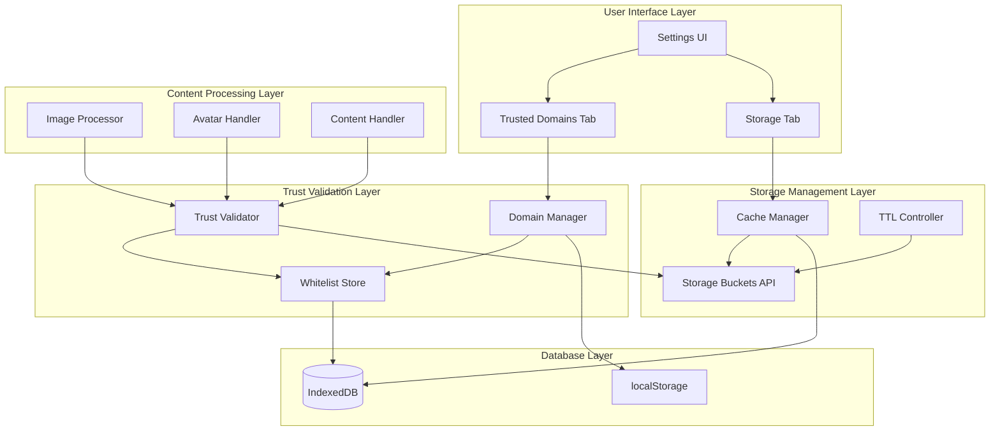
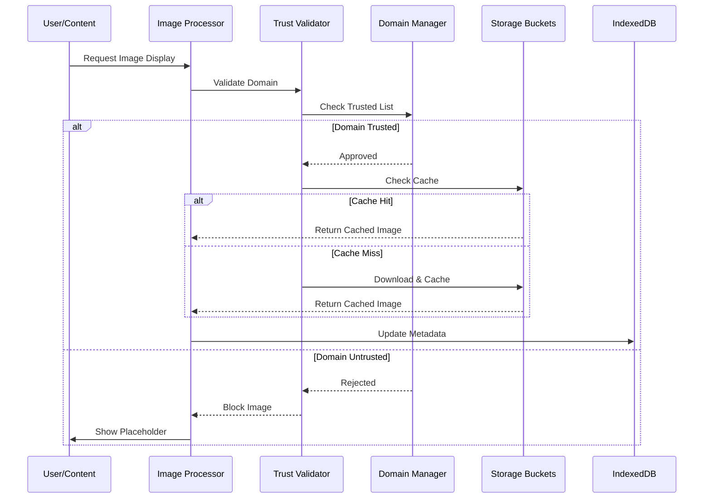
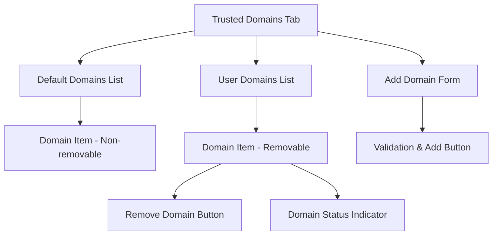
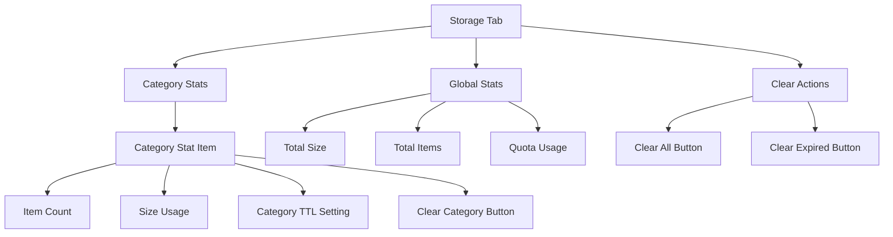

# Trust Domains Implementation Design

## Overview

The Trust Domains system implements a security layer for managing and caching images from trusted sources within the Free Speech Project dApp. This system validates image domains against a trusted list before allowing content to be cached in browser storage buckets, providing users with control over cached content storage and TTL management.

### Core Objectives
- **Security**: Validate image sources against trusted domain lists before caching
- **Performance**: Cache trusted images locally using Storage Buckets API for faster loading
- **User Control**: Provide interface for managing trusted domains and storage quotas
- **Interactive Management**: Enable contextual domain trust management through hover tooltips
- **Visual Feedback**: Show default placeholder for untrusted content with clear user actions
- **Transparency**: Give users visibility into cached content with size tracking and category management

## Architecture

### System Components



### Data Flow Architecture



## Database Schema Extensions

### New IndexedDB Object Stores

#### trusted_domains
```javascript
{
    id: number,           // auto-increment primary key
    domain: string,       // domain name (e.g., "example.com")
    type: string,         // "default" | "user" | "ignored"
    status: number,       // 0=inactive, 1=active, 2=ignored
    rule: string,         // "allow" | "ignore"
    added_time: number,   // unix timestamp
    last_verified: number // unix timestamp
}
```

**Indexes:**
- `domain` (unique): Fast domain lookup
- `type`: Filter by default vs user vs ignored domains
- `status`: Active/inactive/ignored filtering
- `rule`: Filter by allow/ignore rules

#### cached_images
```javascript
{
    id: number,           // auto-increment primary key
    original_url: string, // original image URL
    domain: string,       // extracted domain
    bucket_name: string,  // storage bucket identifier
    cached_url: string,   // blob URL or bucket key
    category: string,     // "avatar" | "image" | "video" | "audio" | "file"
    size_bytes: number,   // file size
    mime_type: string,    // MIME type
    cached_time: number,  // unix timestamp when cached
    last_accessed: number, // unix timestamp last accessed
    ttl_expires: number,  // unix timestamp when expires
    account: string,      // associated account (for avatars)
    block_id: number      // associated content block (if applicable)
}
```

**Indexes:**
- `original_url` (unique): Prevent duplicate caching
- `domain`: Group by domain
- `category`: Filter by content type
- `ttl_expires`: TTL-based cleanup
- `account`: User-specific content
- `last_accessed`: LRU cleanup

### Database Version Update

```javascript
// Update global_db_version from 11 to 12
var global_db_version = 12;

// Add to onupgradeneeded handler
if(!db.objectStoreNames.contains('trusted_domains')){
    items_table = db.createObjectStore('trusted_domains', {keyPath:'id', autoIncrement:true});
    items_table.createIndex('domain', 'domain', {unique:true});
    items_table.createIndex('type', 'type', {unique:false});
    items_table.createIndex('status', 'status', {unique:false});
}

if(!db.objectStoreNames.contains('cached_images')){
    items_table = db.createObjectStore('cached_images', {keyPath:'id', autoIncrement:true});
    items_table.createIndex('original_url', 'original_url', {unique:true});
    items_table.createIndex('domain', 'domain', {unique:false});
    items_table.createIndex('category', 'category', {unique:false});
    items_table.createIndex('ttl_expires', 'ttl_expires', {unique:false});
    items_table.createIndex('account', 'account', {unique:false});
    items_table.createIndex('last_accessed', 'last_accessed', {unique:false});
}
```

## Core Implementation Components

### Trust Domain Manager

```javascript
class TrustDomainManager {
    constructor() {
        this.defaultDomains = [
            'gravatar.com',
            'githubusercontent.com',
            'imgur.com',
            'cloudflare.com',
            'fastly.com'
        ];
        this.cache = new Map();
        this.defaultDomainsSet = new Set(this.defaultDomains); // Fast O(1) default checks
        this.userDomainsCache = new Map(); // Cache for user domains with rules
        this.ignoredDomainsCache = new Set(); // Fast ignored domain checks
        this.initialized = false;
        this.cacheExpiry = 5 * 60 * 1000; // 5 minutes cache TTL
        this.lastCacheUpdate = 0;
    }

    async initialize() {
        console.log('Initializing Trust Domain Manager');
        // Load default domains into IndexedDB if not exists
        await this.ensureDefaultDomainsInDB();
        // Load user domains from IndexedDB into memory cache
        await this.loadUserDomainsToCache();
        // Initialize cache timestamp
        this.lastCacheUpdate = Date.now();
        this.initialized = true;
        console.log('Trust Domain Manager initialized with', this.userDomainsCache.size, 'user domains cached');
    }

    async ensureDefaultDomainsInDB() {
        // Check and insert default domains into IndexedDB if they don't exist
        const t = db.transaction(['trusted_domains'], 'readwrite');
        const q = t.objectStore('trusted_domains');

        for (const domain of this.defaultDomains) {
            const checkReq = q.index('domain').openCursor(IDBKeyRange.only(domain), 'next');
            checkReq.onsuccess = (event) => {
                const cursor = event.target.result;
                if (!cursor) {
                    // Domain doesn't exist, add it
                    q.add({
                        domain: domain,
                        type: 'default',
                        status: 1,
                        rule: 'allow',
                        added_time: Date.now(),
                        last_verified: Date.now()
                    });
                }
            };
        }
    }

    async loadUserDomainsToCache() {
        return new Promise((resolve) => {
            // Clear existing cache
            this.userDomainsCache.clear();
            this.ignoredDomainsCache.clear();

            if (!db.objectStoreNames.contains('trusted_domains')) {
                resolve();
                return;
            }

            const t = db.transaction(['trusted_domains'], 'readonly');
            const q = t.objectStore('trusted_domains');
            const req = q.index('type').openCursor(IDBKeyRange.only('user'), 'next');

            req.onsuccess = (event) => {
                const cursor = event.target.result;
                if (cursor) {
                    const record = cursor.value;
                    const cacheEntry = {
                        rule: record.rule,
                        status: record.status,
                        cached_time: Date.now()
                    };

                    this.userDomainsCache.set(record.domain, cacheEntry);

                    // Add to ignored cache if applicable
                    if (record.rule === 'ignore' && record.status === 1) {
                        this.ignoredDomainsCache.add(record.domain);
                    }

                    cursor.continue();
                } else {
                    console.log('Loaded', this.userDomainsCache.size, 'user domains to cache');
                    resolve();
                }
            };

            req.onerror = () => {
                console.error('Error loading user domains to cache');
                resolve();
            };
        });
    }

    isDomainTrusted(domain) {
        // Fast check for default domains using Set lookup O(1)
        if (this.defaultDomainsSet.has(domain)) {
            console.log('Domain trusted (default):', domain);
            return true;
        }

        // Check user domains cache
        const userDomain = this.userDomainsCache.get(domain);
        if (userDomain) {
            // Validate cache TTL
            if (Date.now() - userDomain.cached_time < this.cacheExpiry) {
                const trusted = userDomain.rule === 'allow' && userDomain.status === 1;
                console.log('Domain trust from cache:', domain, trusted);
                return trusted;
            } else {
                // Cache expired, remove from cache
                this.userDomainsCache.delete(domain);
                this.ignoredDomainsCache.delete(domain);
            }
        }

        // Not in cache or cache expired, return false (will trigger async DB check)
        console.log('Domain not in cache, requires DB check:', domain);
        return false;
    }

    isIgnoredDomain(domain) {
        // Fast check using Set lookup O(1)
        if (this.ignoredDomainsCache.has(domain)) {
            console.log('Domain ignored (cached):', domain);
            return true;
        }

        // Check if cached entry exists and is still valid
        const userDomain = this.userDomainsCache.get(domain);
        if (userDomain && Date.now() - userDomain.cached_time < this.cacheExpiry) {
            const ignored = userDomain.rule === 'ignore' && userDomain.status === 1;
            if (ignored) {
                // Add to ignored cache for faster future lookups
                this.ignoredDomainsCache.add(domain);
            }
            return ignored;
        }

        return false;
    }

    async checkDomainInDBAsync(domain, callback) {
        // Asynchronous DB check with callback pattern
        const t = db.transaction(['trusted_domains'], 'readonly');
        const q = t.objectStore('trusted_domains');
        const req = q.index('domain').openCursor(IDBKeyRange.only(domain), 'next');

        req.onsuccess = (event) => {
            const cursor = event.target.result;
            if (cursor) {
                const record = cursor.value;
                const trusted = record.rule === 'allow' && record.status === 1;
                const ignored = record.rule === 'ignore' && record.status === 1;

                // Update cache if this is a user domain
                if (record.type === 'user') {
                    this.userDomainsCache.set(domain, {
                        rule: record.rule,
                        status: record.status,
                        cached_time: Date.now()
                    });

                    if (ignored) {
                        this.ignoredDomainsCache.add(domain);
                    }
                }

                console.log('Domain DB check result:', domain, 'trusted:', trusted, 'ignored:', ignored);
                callback(trusted, ignored);
            } else {
                console.log('Domain not found in DB:', domain);
                callback(false, false);
            }
        };

        req.onerror = () => {
            console.error('Error checking domain in DB:', domain);
            callback(false, false);
        };
    }

    invalidateCache() {
        // Force cache refresh
        this.userDomainsCache.clear();
        this.ignoredDomainsCache.clear();
        this.lastCacheUpdate = 0;
        console.log('Trust domain cache invalidated');
    }

    async refreshCacheIfNeeded() {
        // Refresh cache if it's been too long since last update
        if (Date.now() - this.lastCacheUpdate > this.cacheExpiry) {
            console.log('Refreshing trust domain cache');
            await this.loadUserDomainsToCache();
            this.lastCacheUpdate = Date.now();
        }
    }

    async addTrustedDomain(domain, rule = 'allow', type = 'user') {
        // Validate domain format
        if (!this.isValidDomain(domain)) {
            throw new Error('Invalid domain format');
        }

        // Check if domain already exists
        if (this.defaultDomainsSet.has(domain)) {
            throw new Error('Domain is already in default trusted list');
        }

        // Add to IndexedDB with rule (allow/ignore)
        const t = db.transaction(['trusted_domains'], 'readwrite');
        const q = t.objectStore('trusted_domains');

        const domainRecord = {
            domain: domain,
            type: type,
            status: 1,
            rule: rule,
            added_time: Date.now(),
            last_verified: Date.now()
        };

        const req = q.add(domainRecord);
        req.onsuccess = () => {
            // Update memory cache immediately
            this.userDomainsCache.set(domain, {
                rule: rule,
                status: 1,
                cached_time: Date.now()
            });

            if (rule === 'ignore') {
                this.ignoredDomainsCache.add(domain);
            } else {
                this.ignoredDomainsCache.delete(domain);
            }

            console.log('Domain added to trusted list:', domain, 'rule:', rule);
        };

        req.onerror = () => {
            console.error('Error adding domain to trusted list:', domain);
            throw new Error('Failed to add domain to database');
        };
    }

    async ignoreDomain(domain) {
        // Add domain to ignored list
        await this.addTrustedDomain(domain, 'ignore', 'user');
        console.log('Domain added to ignore list:', domain);
    }

    async removeTrustedDomain(domain) {
        // Only allow removal of user domains
        if (this.defaultDomainsSet.has(domain)) {
            throw new Error('Cannot remove default trusted domain');
        }

        // Update IndexedDB status to inactive
        const t = db.transaction(['trusted_domains'], 'readwrite');
        const q = t.objectStore('trusted_domains');
        const req = q.index('domain').openCursor(IDBKeyRange.only(domain), 'next');

        req.onsuccess = (event) => {
            const cursor = event.target.result;
            if (cursor && cursor.value.type === 'user') {
                const record = cursor.value;
                record.status = 0; // Set to inactive
                cursor.update(record);

                // Remove from memory cache
                this.userDomainsCache.delete(domain);
                this.ignoredDomainsCache.delete(domain);

                console.log('Domain removed from trusted list:', domain);
                // TODO: Clean associated cached content
            }
        };
    }

    isValidDomain(domain) {
        // Basic domain validation
        const domainRegex = /^[a-zA-Z0-9][a-zA-Z0-9-_.]*[a-zA-Z0-9]$/;
        return domainRegex.test(domain) && domain.length > 2 && domain.length < 255;
    }

    extractDomain(url) {
        // Extract domain from URL
        // Handle special cases (IPFS, SIA)
        // Return normalized domain
    }
}
```

### Storage Bucket Manager

```javascript
class StorageBucketManager {
    constructor() {
        this.buckets = new Map();
        this.categories = ['avatar', 'image', 'video', 'audio', 'file'];
        this.defaultTTL = 30 * 24 * 60 * 60 * 1000; // 30 days
    }

    async initializeBuckets() {
        // Create storage buckets for each category
        // Set quota limits if supported
        // Initialize bucket references
    }

    async cacheImage(url, category, options = {}) {
        // Validate domain trust
        // Check existing cache
        // Download and store in appropriate bucket
        // Update IndexedDB metadata
        // Return cached URL
    }

    async getCachedImage(url) {
        // Check IndexedDB for cached entry
        // Verify TTL validity
        // Return cached URL or null
    }

    async cleanupExpired() {
        // Query expired entries from IndexedDB
        // Remove from storage buckets
        // Update IndexedDB
    }

    async getStorageStats() {
        // Calculate usage per category
        // Return stats object
    }

    async clearCategory(category) {
        // Remove all items in category
        // Update IndexedDB
        // Return success status
    }
}
```

### Image Validation Pipeline

```javascript
function validateAndCacheImage(url, category = 'image', account = null, callback) {
    // Extract domain from URL
    const domain = trustDomainManager.extractDomain(url);

    // Fast synchronous checks first
    if (trustDomainManager.isIgnoredDomain(domain)) {
        console.log('Domain ignored by user:', domain);
        const result = category === 'avatar' ? ltmp_global.profile_default_avatar : null;
        if (callback) callback(result);
        return result;
    }

    // Check if domain is trusted (synchronous for cached/default domains)
    if (trustDomainManager.isDomainTrusted(domain)) {
        console.log('Domain trusted (cached/default):', domain);
        // Check existing cache
        storageBucketManager.getCachedImage(url).then(cached => {
            if (cached && validateCacheTTL(cached)) {
                updateLastAccessed(cached.id);
                if (callback) callback(cached.cached_url);
                return cached.cached_url;
            } else {
                // Cache new image
                storageBucketManager.cacheImage(url, category, { account }).then(result => {
                    if (callback) callback(result);
                });
            }
        });
        return url; // Return original URL immediately for trusted domains
    }

    // Domain not in cache, need async DB check
    console.log('Domain requires DB check:', domain);
    trustDomainManager.checkDomainInDBAsync(domain, (trusted, ignored) => {
        if (ignored) {
            const result = category === 'avatar' ? ltmp_global.profile_default_avatar : null;
            if (callback) callback(result);
            return;
        }

        if (trusted) {
            // Cache and return trusted image
            storageBucketManager.getCachedImage(url).then(cached => {
                if (cached && validateCacheTTL(cached)) {
                    updateLastAccessed(cached.id);
                    if (callback) callback(cached.cached_url);
                } else {
                    storageBucketManager.cacheImage(url, category, { account }).then(result => {
                        if (callback) callback(result);
                    });
                }
            });
        } else {
            // Domain not trusted, return placeholder
            const result = {
                url: category === 'avatar' ? ltmp_global.profile_untrusted_avatar : null,
                untrusted: true,
                domain: domain,
                original_url: url
            };
            if (callback) callback(result);
        }
    });

    // Return placeholder immediately for async processing
    return {
        url: category === 'avatar' ? ltmp_global.profile_untrusted_avatar : null,
        untrusted: true,
        domain: domain,
        original_url: url
    };
}

// Synchronous version for cached domains only
function validateDomainSync(url, category = 'image') {
    const domain = trustDomainManager.extractDomain(url);

    // Fast checks only
    if (trustDomainManager.isIgnoredDomain(domain)) {
        return category === 'avatar' ? ltmp_global.profile_default_avatar : null;
    }

    if (trustDomainManager.isDomainTrusted(domain)) {
        return url; // Return original URL for trusted domains
    }

    // Unknown domain, return placeholder
    return {
        url: category === 'avatar' ? ltmp_global.profile_untrusted_avatar : null,
        untrusted: true,
        domain: domain,
        original_url: url
    };
}
```

### Interactive Tooltip System

```javascript
class UntrustedImageTooltip {
    constructor() {
        this.activeTooltip = null;
        this.tooltipTimeout = null;
        this.initializeEventListeners();
    }

    initializeEventListeners() {
        // Set up global mouse events for tooltip management
        document.addEventListener('mouseover', this.handleMouseOver.bind(this));
        document.addEventListener('mouseout', this.handleMouseOut.bind(this));
        document.addEventListener('click', this.handleTooltipClick.bind(this));
    }

    handleMouseOver(event) {
        const element = event.target;
        // Check if element is an untrusted image placeholder
        if (element.classList.contains('untrusted-image') && element.dataset.domain) {
            this.showTooltip(element, element.dataset.domain, element.dataset.originalUrl);
        }
    }

    handleMouseOut(event) {
        const element = event.target;
        if (element.classList.contains('untrusted-image')) {
            this.hideTooltip();
        }
    }

    showTooltip(element, domain, originalUrl) {
        // Clear existing tooltip
        this.hideTooltip();

        // Create tooltip element
        const tooltip = document.createElement('div');
        tooltip.className = 'trust-domain-tooltip';
        tooltip.innerHTML = ltmp(ltmp_arr.trust_domain_tooltip, {
            domain: escape_html(domain),
            add_button: ltmp_arr.trust_domain_add_button,
            ignore_button: ltmp_arr.trust_domain_ignore_button
        });

        // Position tooltip
        const rect = element.getBoundingClientRect();
        tooltip.style.position = 'absolute';
        tooltip.style.top = (rect.bottom + window.scrollY + 5) + 'px';
        tooltip.style.left = (rect.left + window.scrollX) + 'px';
        tooltip.style.zIndex = '10000';

        // Store reference data
        tooltip.dataset.domain = domain;
        tooltip.dataset.originalUrl = originalUrl;

        document.body.appendChild(tooltip);
        this.activeTooltip = tooltip;
    }

    hideTooltip() {
        if (this.activeTooltip) {
            this.activeTooltip.remove();
            this.activeTooltip = null;
        }
        if (this.tooltipTimeout) {
            clearTimeout(this.tooltipTimeout);
            this.tooltipTimeout = null;
        }
    }

    handleTooltipClick(event) {
        if (!this.activeTooltip) return;

        const button = event.target.closest('.tooltip-action');
        if (!button) return;

        const domain = this.activeTooltip.dataset.domain;
        const action = button.dataset.action;

        if (action === 'add') {
            this.addDomainToTrusted(domain);
        } else if (action === 'ignore') {
            this.ignoreDomain(domain);
        }

        this.hideTooltip();
        event.preventDefault();
        event.stopPropagation();
    }

    async addDomainToTrusted(domain) {
        try {
            await trustDomainManager.addTrustedDomain(domain, 'allow', 'user');
            add_notify(ltmp(ltmp_arr.trust_domain_added_success, {domain: escape_html(domain)}), 'positive');
            this.refreshImagesForDomain(domain);
        } catch (error) {
            add_notify(ltmp(ltmp_arr.trust_domain_add_error, {error: error.message}), 'negative');
        }
    }

    async ignoreDomain(domain) {
        try {
            await trustDomainManager.ignoreDomain(domain);
            add_notify(ltmp(ltmp_arr.trust_domain_ignored_success, {domain: escape_html(domain)}), 'positive');
            this.refreshImagesForDomain(domain);
        } catch (error) {
            add_notify(ltmp(ltmp_arr.trust_domain_ignore_error, {error: error.message}), 'negative');
        }
    }

    refreshImagesForDomain(domain) {
        // Find all untrusted images from this domain and refresh them
        const untrustedImages = document.querySelectorAll(`img.untrusted-image[data-domain="${domain}"]`);
        untrustedImages.forEach(img => {
            const originalUrl = img.dataset.originalUrl;
            if (originalUrl) {
                // Re-validate and potentially load the image
                validateAndCacheImage(originalUrl, img.dataset.category || 'image')
                    .then(result => {
                        if (result && typeof result === 'string') {
                            img.src = result;
                            img.classList.remove('untrusted-image');
                            img.removeAttribute('data-domain');
                            img.removeAttribute('data-original-url');
                        }
                    });
            }
        });
    }
}

// Initialize tooltip system
const untrustedImageTooltip = new UntrustedImageTooltip();

// Helper function to store untrusted image info
function storeUntrustedImageInfo(originalUrl, domain, category) {
    // This function will be called when rendering untrusted images
    // It helps track which images need domain management
    return {
        'data-domain': domain,
        'data-original-url': originalUrl,
        'data-category': category,
        'class': 'untrusted-image'
    };
}
```

## User Interface Components

### Settings Page Extensions

#### Trusted Domains Tab



**Template Structure:**
```html
<div class="content-view" data-tab="trusted-domains">
    <div class="section-header">
        <h3>{localized_title}</h3>
        <p>{localized_description}</p>
    </div>

    <div class="default-domains-section">
        <h4>{default_domains_title}</h4>
        <div class="domain-list default" id="default-domains-list">
            <!-- Default domains (non-removable) -->
        </div>
    </div>

    <div class="user-domains-section">
        <h4>{user_domains_title}</h4>
        <div class="domain-list user" id="user-domains-list">
            <!-- User domains (removable) -->
        </div>

        <div class="add-domain-form">
            <input type="text" name="new-domain" placeholder="{domain_placeholder}">
            <button type="button" class="add-domain-btn">{add_button_text}</button>
        </div>
    </div>

    <div class="form-actions">
        <button type="button" class="save-trusted-domains-btn">{save_button}</button>
    </div>
</div>
```

#### Storage Management Tab



**Template Structure:**
```html
<div class="content-view" data-tab="storage">
    <div class="section-header">
        <h3>{storage_management_title}</h3>
        <p>{storage_description}</p>
    </div>

    <div class="global-stats">
        <div class="stat-item total-size">
            <span class="label">{total_size_label}</span>
            <span class="value" id="total-size-value">0 MB</span>
        </div>
        <div class="stat-item total-items">
            <span class="label">{total_items_label}</span>
            <span class="value" id="total-items-value">0</span>
        </div>
        <div class="stat-item quota-usage">
            <span class="label">{quota_usage_label}</span>
            <span class="value" id="quota-usage-value">0%</span>
        </div>
    </div>

    <div class="category-stats">
        <!-- Generated for each category -->
        <div class="category-item" data-category="{category}">
            <div class="category-info">
                <h4>{category_name}</h4>
                <div class="category-meta">
                    <span class="count">{item_count} items</span>
                    <span class="size">{size_mb} MB</span>
                </div>
            </div>
            <div class="category-controls">
                <input type="number" name="ttl-{category}" value="{ttl_days}" min="1" max="365">
                <span>days</span>
                <button class="clear-category-btn" data-category="{category}">
                    {clear_category_text}
                </button>
            </div>
        </div>
    </div>

    <div class="global-actions">
        <button type="button" class="clear-expired-btn">{clear_expired_text}</button>
        <button type="button" class="clear-all-btn confirm-action">{clear_all_text}</button>
    </div>
</div>
```

### Settings Integration

```javascript
// Add to default_settings
var default_settings = {
    // ... existing settings
    trust_domains_enabled: true,
    storage_default_ttl: 30, // days
    storage_category_ttl: {
        avatar: 30,
        image: 30,
        video: 7,
        audio: 14,
        file: 7
    },
    storage_auto_cleanup: true,
    storage_max_size_mb: 1000
};

// Add save functions
function save_trusted_domains_settings(view) {
    let tab = view.find('.content-view[data-tab="trusted-domains"]');
    // Save trusted domains configuration
    // Update localStorage settings
    // Show success message
}

function save_storage_settings(view) {
    let tab = view.find('.content-view[data-tab="storage"]');
    // Save TTL settings per category
    // Update localStorage settings
    // Show success message
}
```

## Integration Points

### Image Processing Integration

```javascript
// Modify safe_avatar function
function safe_avatar(avatar) {
    let result = '';
    let error = false;

    if (0 == avatar.indexOf('https://')) {
        // Check domain trust status
        const domain = trustDomainManager.extractDomain(avatar);

        if (trustDomainManager.isIgnoredDomain(domain)) {
            result = ltmp_global.profile_default_avatar;
        } else if (trustDomainManager.isDomainTrusted(domain)) {
            // Try to get cached version first
            const cached = await storageBucketManager.getCachedImage(avatar);
            result = cached ? cached.cached_url : avatar;

            // Cache in background if not cached
            if (!cached) {
                validateAndCacheImage(avatar, 'avatar');
            }
        } else {
            // Use untrusted placeholder with tooltip data
            result = ltmp_global.profile_untrusted_avatar;
            // Store domain info for tooltip system
            storeUntrustedImageInfo(avatar, domain, 'avatar');
        }
    }
    else if (0 == avatar.indexOf('ipfs://')) {
        result = ipfs_link(avatar.substring(7));
    }
    else if (0 == avatar.indexOf('sia://')) {
        result = sia_link(avatar.substring(6));
    }
    else if (0 == avatar.indexOf('http://')) {
        error = true; // no http
    }
    else if (0 == avatar.indexOf('data:')) {
        error = true; // no encoded
    }
    else {
        error = true; // unknown
    }

    if (error) {
        result = ltmp_global.profile_default_avatar;
    }
    return result;
}

// Modify safe_image function
function safe_image(image_url) {
    let result = '';
    let error = false;

    if (0 == image_url.indexOf('https://')) {
        const domain = trustDomainManager.extractDomain(image_url);

        if (trustDomainManager.isIgnoredDomain(domain)) {
            return null; // Don't show ignored content images
        } else if (trustDomainManager.isDomainTrusted(domain)) {
            result = image_url;
            // Cache in background
            validateAndCacheImage(image_url, 'image');
        } else {
            return null; // Don't show untrusted content images
        }
    }
    else if (0 == image_url.indexOf('ipfs://')) {
        result = ipfs_link(image_url.substring(7));
    }
    else if (0 == image_url.indexOf('sia://')) {
        result = sia_link(image_url.substring(6));
    }
    else {
        error = true;
    }

    if (error) {
        return null;
    }
    return result;
}
```

### Content Rendering Integration

```javascript
// Add to render_object function - early security check
function render_object(account, block, type, check_level) {
    // ... existing code

    // Before processing images, validate domains
    if (obj.data && obj.data.i) {
        const domain = trustDomainManager.extractDomain(obj.data.i);
        if (trustDomainManager.isIgnoredDomain(domain)) {
            obj.data.i = null; // Remove ignored image
        } else if (!trustDomainManager.isDomainTrusted(domain)) {
            obj.data.i = null; // Remove untrusted image
        } else {
            // Cache trusted image
            validateAndCacheImage(obj.data.i, 'image', account);
        }
    }

    // ... continue with existing rendering logic
}
```

## Localization Keys

### English (ltmp_en.js)
```javascript
// Trusted Domains
trusted_domains_tab: 'Trusted Domains',
trusted_domains_title: 'Trusted Domains Management',
trusted_domains_description: 'Manage domains that are trusted for image caching',
default_domains_title: 'Default Trusted Domains',
user_domains_title: 'User Added Domains',
add_domain_placeholder: 'Enter domain (e.g., example.com)',
add_domain_button: 'Add Domain',
remove_domain_button: 'Remove',
domain_added_success: 'Domain added successfully',
domain_removed_success: 'Domain removed successfully',
domain_invalid_error: 'Invalid domain format',
domain_already_exists: 'Domain already exists',

// Trust Domain Tooltips
trust_domain_tooltip: '<div class="tooltip-header">Domain: <strong>{{domain}}</strong></div><div class="tooltip-actions"><button class="tooltip-action" data-action="add">{{add_button}}</button><button class="tooltip-action" data-action="ignore">{{ignore_button}}</button></div>',
trust_domain_add_button: 'Add {{domain}} to Trust Domains',
trust_domain_ignore_button: 'Ignore {{domain}} in future',
trust_domain_added_success: 'Domain {{domain}} added to trusted list',
trust_domain_ignored_success: 'Domain {{domain}} will be ignored',
trust_domain_add_error: 'Failed to add domain: {{error}}',
trust_domain_ignore_error: 'Failed to ignore domain: {{error}}',

// Storage Management
storage_tab: 'Storage',
storage_management_title: 'Cache Storage Management',
storage_description: 'Monitor and manage cached content storage',
total_size_label: 'Total Size:',
total_items_label: 'Total Items:',
quota_usage_label: 'Quota Usage:',
category_avatars: 'Avatars',
category_images: 'Images',
category_videos: 'Videos',
category_audio: 'Audio',
category_files: 'Files',
clear_category_button: 'Clear Category',
clear_expired_button: 'Clear Expired',
clear_all_button: 'Clear All Cache',
ttl_days_label: 'TTL (days):',
storage_cleared_success: 'Storage cleared successfully',
storage_cleanup_success: 'Expired content cleaned up'
```

### Russian (ltmp_ru.js)
```javascript
// Trusted Domains
trusted_domains_tab: 'Доверенные домены',
trusted_domains_title: 'Управление доверенными доменами',
trusted_domains_description: 'Управление доменами, которым разрешено кэширование изображений',
default_domains_title: 'Доверенные домены по умолчанию',
user_domains_title: 'Пользовательские домены',
add_domain_placeholder: 'Введите домен (например, example.com)',
add_domain_button: 'Добавить домен',
remove_domain_button: 'Удалить',
domain_added_success: 'Домен успешно добавлен',
domain_removed_success: 'Домен успешно удален',
domain_invalid_error: 'Неверный формат домена',
domain_already_exists: 'Домен уже существует',

// Trust Domain Tooltips
trust_domain_tooltip: '<div class="tooltip-header">Домен: <strong>{{domain}}</strong></div><div class="tooltip-actions"><button class="tooltip-action" data-action="add">{{add_button}}</button><button class="tooltip-action" data-action="ignore">{{ignore_button}}</button></div>',
trust_domain_add_button: 'Добавить {{domain}} в доверенные домены',
trust_domain_ignore_button: 'Игнорировать {{domain}} в будущем',
trust_domain_added_success: 'Домен {{domain}} добавлен в доверенный список',
trust_domain_ignored_success: 'Домен {{domain}} будет игнорироваться',
trust_domain_add_error: 'Не удалось добавить домен: {{error}}',
trust_domain_ignore_error: 'Не удалось игнорировать домен: {{error}}',

// Storage Management
storage_tab: 'Хранилище',
storage_management_title: 'Управление кэш-хранилищем',
storage_description: 'Мониторинг и управление кэшированным контентом',
total_size_label: 'Общий размер:',
total_items_label: 'Всего элементов:',
quota_usage_label: 'Использование квоты:',
category_avatars: 'Аватары',
category_images: 'Изображения',
category_videos: 'Видео',
category_audio: 'Аудио',
category_files: 'Файлы',
clear_category_button: 'Очистить категорию',
clear_expired_button: 'Удалить просроченные',
clear_all_button: 'Очистить весь кэш',
ttl_days_label: 'TTL (дни):',
storage_cleared_success: 'Хранилище успешно очищено',
storage_cleanup_success: 'Просроченный контент удален'
```

## CSS Styling for Trust Domain System

### Tooltip Styling
```css
.trust-domain-tooltip {
    background: var(--bg-secondary);
    border: 1px solid var(--border-primary);
    border-radius: 6px;
    padding: 12px;
    box-shadow: 0 4px 12px var(--shadow-primary);
    font-size: 14px;
    max-width: 300px;
    z-index: 10000;
    pointer-events: auto;
}

.tooltip-header {
    margin-bottom: 8px;
    color: var(--text-primary);
    font-weight: 500;
}

.tooltip-actions {
    display: flex;
    gap: 8px;
    justify-content: space-between;
}

.tooltip-action {
    flex: 1;
    padding: 6px 12px;
    border: 1px solid var(--border-input);
    border-radius: 4px;
    background: var(--bg-primary);
    color: var(--text-primary);
    font-size: 12px;
    cursor: pointer;
    transition: all 0.2s ease;
}

.tooltip-action:hover {
    background: var(--bg-highlight);
    border-color: var(--border-focus);
}

.tooltip-action[data-action="add"] {
    background: var(--success-bg);
    color: var(--success-text);
    border-color: var(--success-border);
}

.tooltip-action[data-action="ignore"] {
    background: var(--warning-bg);
    color: var(--warning-text);
    border-color: var(--warning-border);
}

.tooltip-action[data-action="add"]:hover {
    background: var(--success-hover-bg);
}

.tooltip-action[data-action="ignore"]:hover {
    background: var(--warning-hover-bg);
}
```

### Untrusted Image Styling
```css
.untrusted-image {
    opacity: 0.6;
    cursor: help;
    filter: grayscale(20%);
    transition: all 0.2s ease;
    position: relative;
}

.untrusted-image:hover {
    opacity: 0.8;
    filter: grayscale(0%);
}

.untrusted-image::after {
    content: '⚠️';
    position: absolute;
    top: 4px;
    right: 4px;
    background: var(--warning-bg);
    color: var(--warning-icon-text);
    border-radius: 50%;
    width: 20px;
    height: 20px;
    display: flex;
    align-items: center;
    justify-content: center;
    font-size: 12px;
    box-shadow: 0 2px 4px var(--shadow-secondary);
}

/* Avatar specific styling */
.avatar-untrusted {
    border: 2px solid var(--warning-border);
    border-radius: 50%;
}

.avatar-untrusted::after {
    content: '🔒';
    font-size: 10px;
}
```

### Required CSS Variables for Trust Domain System

The following CSS variables should be added to the theme system in `app.css`:

```css
:root {
    /* Trust Domain System Variables */
    --success-bg: #e8f5e8;
    --success-text: #2e7d2e;
    --success-border: #4caf50;
    --success-hover-bg: #dcedc8;

    --warning-bg: #fff3e0;
    --warning-text: #f57c00;
    --warning-border: #ff9800;
    --warning-hover-bg: #ffe0b2;
    --warning-icon-text: #fff;

    --shadow-primary: rgba(0, 0, 0, 0.15);
    --shadow-secondary: rgba(0, 0, 0, 0.2);
}

.midnight {
    /* Midnight theme overrides */
    --success-bg: #1b2e1b;
    --success-text: #66bb6a;
    --success-border: #388e3c;
    --success-hover-bg: #2e3a2e;

    --warning-bg: #2d1f0a;
    --warning-text: #ffb74d;
    --warning-border: #f57c00;
    --warning-hover-bg: #3d2f1a;
    --warning-icon-text: #212121;

    --shadow-primary: rgba(0, 0, 0, 0.3);
    --shadow-secondary: rgba(0, 0, 0, 0.4);
}

.dark {
    /* Dark theme overrides */
    --success-bg: #263d26;
    --success-text: #81c784;
    --success-border: #4caf50;
    --success-hover-bg: #2e4d2e;

    --warning-bg: #3d2a0f;
    --warning-text: #ffcc02;
    --warning-border: #ff9800;
    --warning-hover-bg: #4d3a1f;
    --warning-icon-text: #000;

    --shadow-primary: rgba(0, 0, 0, 0.25);
    --shadow-secondary: rgba(0, 0, 0, 0.35);
}
```

### Trusted Domains Settings Tab Styling
```css
.content-view[data-tab="trusted-domains"] {
    padding: var(--content-padding);
}

.domain-list {
    margin-bottom: 20px;
}

.domain-item {
    display: flex;
    align-items: center;
    justify-content: space-between;
    padding: 12px 16px;
    border: 1px solid var(--border-secondary);
    border-radius: 6px;
    margin-bottom: 8px;
    background: var(--bg-primary);
}

.domain-item.default {
    background: var(--bg-tertiary);
    border-color: var(--border-tertiary);
}

.domain-name {
    font-family: var(--font-mono);
    color: var(--text-primary);
    font-weight: 500;
}

.domain-status {
    display: flex;
    align-items: center;
    gap: 8px;
}

.domain-type-badge {
    padding: 2px 8px;
    border-radius: 4px;
    font-size: 11px;
    font-weight: 500;
    text-transform: uppercase;
}

.domain-type-badge.default {
    background: var(--info-bg);
    color: var(--info-text);
    border: 1px solid var(--info-border);
}

.domain-type-badge.user {
    background: var(--success-bg);
    color: var(--success-text);
    border: 1px solid var(--success-border);
}

.domain-type-badge.ignored {
    background: var(--warning-bg);
    color: var(--warning-text);
    border: 1px solid var(--warning-border);
}

.add-domain-form {
    display: flex;
    gap: 12px;
    margin-top: 16px;
    padding: 16px;
    background: var(--bg-secondary);
    border-radius: 6px;
    border: 1px solid var(--border-secondary);
}

.add-domain-form input[type="text"] {
    flex: 1;
    padding: 8px 12px;
    border: 1px solid var(--border-input);
    border-radius: 4px;
    background: var(--bg-primary);
    color: var(--text-primary);
    font-family: var(--font-mono);
}

.add-domain-form input[type="text"]:focus {
    border-color: var(--border-focus);
    outline: none;
    box-shadow: 0 0 0 2px var(--focus-ring);
}

.add-domain-btn {
    padding: 8px 16px;
    border: 1px solid var(--border-input);
    border-radius: 4px;
    background: var(--bg-primary);
    color: var(--text-primary);
    cursor: pointer;
    transition: all 0.2s ease;
}

.add-domain-btn:hover {
    background: var(--bg-highlight);
    border-color: var(--border-focus);
}
```

### Storage Management Tab Styling
```css
.content-view[data-tab="storage"] {
    padding: var(--content-padding);
}

.global-stats {
    display: grid;
    grid-template-columns: repeat(auto-fit, minmax(200px, 1fr));
    gap: 16px;
    margin-bottom: 24px;
}

.stat-item {
    padding: 16px;
    background: var(--bg-secondary);
    border: 1px solid var(--border-secondary);
    border-radius: 6px;
    text-align: center;
}

.stat-item .label {
    display: block;
    color: var(--text-secondary);
    font-size: 14px;
    margin-bottom: 8px;
}

.stat-item .value {
    display: block;
    color: var(--text-primary);
    font-size: 24px;
    font-weight: 600;
}

.category-item {
    display: flex;
    align-items: center;
    justify-content: space-between;
    padding: 16px;
    border: 1px solid var(--border-secondary);
    border-radius: 6px;
    margin-bottom: 12px;
    background: var(--bg-primary);
}

.category-info h4 {
    color: var(--text-primary);
    margin: 0 0 4px 0;
    font-size: 16px;
}

.category-meta {
    color: var(--text-secondary);
    font-size: 14px;
}

.category-controls {
    display: flex;
    align-items: center;
    gap: 12px;
}

.category-controls input[type="number"] {
    width: 80px;
    padding: 6px 8px;
    border: 1px solid var(--border-input);
    border-radius: 4px;
    background: var(--bg-primary);
    color: var(--text-primary);
}

.clear-category-btn {
    padding: 6px 12px;
    border: 1px solid var(--warning-border);
    border-radius: 4px;
    background: var(--warning-bg);
    color: var(--warning-text);
    cursor: pointer;
    font-size: 12px;
    transition: all 0.2s ease;
}

.clear-category-btn:hover {
    background: var(--warning-hover-bg);
}

.global-actions {
    display: flex;
    gap: 12px;
    margin-top: 24px;
    padding-top: 16px;
    border-top: 1px solid var(--border-secondary);
}

.clear-expired-btn,
.clear-all-btn {
    padding: 10px 20px;
    border-radius: 4px;
    cursor: pointer;
    font-weight: 500;
    transition: all 0.2s ease;
}

.clear-expired-btn {
    border: 1px solid var(--border-input);
    background: var(--bg-primary);
    color: var(--text-primary);
}

.clear-expired-btn:hover {
    background: var(--bg-highlight);
    border-color: var(--border-focus);
}

.clear-all-btn {
    border: 1px solid var(--error-border);
    background: var(--error-bg);
    color: var(--error-text);
}

.clear-all-btn:hover {
    background: var(--error-hover-bg);
}
```

## Performance Considerations

### CORS Limitations and Image Handling

A critical consideration for HTTPS avatar caching is **CORS (Cross-Origin Resource Sharing)**.

#### Complete Protocol/CORS Capability Matrix

| Protocol | CORS | `` Display | `fetch()` Read | Cache in IndexedDB | Cache in Storage Bucket | Service Worker Cache | Recommendation |
|----------|------|-----------------|----------------|--------------------|-----------------------|---------------------|----------------|
| **HTTPS** | ✅ Enabled | ✅ Yes | ✅ Yes | ✅ Yes | ✅ Yes | ✅ Yes | **Best choice** |
| **HTTPS** | ❌ Disabled | ✅ Yes | ❌ No (opaque) | ❌ No | ❌ No | ⚠️ Opaque only* | Use original URL |
| **HTTP** | ✅ Enabled | ⚠️ Mixed content | ❌ Blocked | ❌ No | ❌ No | ❌ No | **Reject** |
| **HTTP** | ❌ Disabled | ⚠️ Mixed content | ❌ Blocked | ❌ No | ❌ No | ❌ No | **Reject** |
| **IPFS** | N/A (gateway) | ✅ Yes | ✅ Yes** | ✅ Yes | ✅ Yes | ✅ Yes | **Recommended** |
| **SIA** | N/A (gateway) | ✅ Yes | ✅ Yes** | ✅ Yes | ✅ Yes | ✅ Yes | **Recommended** |
| **data:** | N/A | ✅ Yes | ✅ Yes | ⚠️ Large size | ⚠️ Large size | ⚠️ Large size | Avoid (bloat) |
| **blob:** | N/A | ✅ Yes | ✅ Yes | ❌ Temporary | ❌ Temporary | ❌ Temporary | Session only |

*Service Worker can cache opaque responses but can't read/validate them, and they count as ~7MB against quota regardless of actual size.

**IPFS/SIA gateways typically have CORS enabled.

#### Browser Cache vs Application Cache

```
┌─────────────────────────────────────────────────────────────────────────────┐
│                        Browser Cache Hierarchy                               │
├─────────────────────────────────────────────────────────────────────────────┤
│                                                                              │
│  ┌──────────────────┐    Automatic, controlled by HTTP headers               │
│  │  Browser HTTP    │    (Cache-Control, ETag, Last-Modified)                │
│  │  Cache (Disk)    │    ✅ Works for ALL images regardless of CORS          │
│  └────────┬─────────┘    ❌ Cannot be read by JavaScript                     │
│           │                                                                  │
│           ▼                                                                  │
│  ┌──────────────────┐    Requires CORS headers from server                   │
│  │  Service Worker  │    fetch() → cache.put()                               │
│  │  Cache API       │    ✅ Offline support, controlled expiry               │
│  └────────┬─────────┘    ⚠️ Opaque responses for non-CORS                   │
│           │                                                                  │
│           ▼                                                                  │
│  ┌──────────────────┐    Requires CORS headers from server                   │
│  │  Storage Bucket  │    fetch() → blob → bucket.caches.put()                │
│  │  API             │    ✅ Quota management, persistence                    │
│  └────────┬─────────┘    ❌ Fails silently for non-CORS                      │
│           │                                                                  │
│           ▼                                                                  │
│  ┌──────────────────┐    Requires CORS headers from server                   │
│  │  IndexedDB       │    fetch() → blob → store as ArrayBuffer               │
│  │  (Blob Storage)  │    ✅ Full control, metadata, TTL                      │
│  └──────────────────┘    ❌ Cannot access non-CORS images                    │
│                                                                              │
└─────────────────────────────────────────────────────────────────────────────┘
```

#### Fallback Strategy Implementation

```javascript
// Priority-based caching with graceful degradation
async function cacheImageWithFallback(url, category) {
  // 1. Check IndexedDB/Storage Bucket first (fastest)
  const cached = await getCachedImage(url);
  if (cached) return cached;

  // 2. Try fetch with CORS
  try {
    const response = await fetch(url, { mode: 'cors', credentials: 'omit' });
    if (response.ok) {
      const blob = await response.blob();
      await cacheBlob(url, blob, category);  // Store in IndexedDB/Bucket
      return URL.createObjectURL(blob);
    }
  } catch (corsError) {
    // 3. CORS failed - image still displays via  tag
    // Browser HTTP cache will handle repeat requests
    console.log('CORS blocked, using original URL (browser cache active)');
  }

  return url;  // Original URL - browser cache handles efficiency
}
```

**Fallback Status Codes:**
- `newly_cached` - Successfully downloaded and cached in IndexedDB/Bucket
- `bucket_cached` - Retrieved from Storage Bucket cache
- `cors_blocked_fallback` - CORS prevented caching, using original URL
- `cors_fallback_status` - Server returned error status, using original URL
- `cors_fallback_content_type` - Wrong content-type, using original URL
- `cors_fallback_size` - File too large, using original URL
- `error_fallback` - Unexpected error, using original URL

**Key Insight:** Even when our application cache fails due to CORS, the **browser's HTTP cache** still works! The browser caches images based on HTTP headers regardless of CORS - we just can't access that cache programmatically.

---

### Recommended Decentralized Storage Architecture

For a truly decentralized dApp with full caching support, use storage providers that **enable CORS by default**:

#### Decentralized Storage Comparison

##### Truly Decentralized (Native Crypto Payments)

| Storage Type | CORS | Payment | Crypto Native | Permanence | Notes |
|--------------|------|---------|---------------|------------|-------|
| **IPFS (self-hosted node)** | ✅ Configurable | Free | ✅ N/A | User controlled | Run your own node, full control |
| **SIA (direct)** | ✅ Yes | SC token | ✅ Yes | Contract-based | Native Siacoin, truly decentralized |
| **Filecoin (direct)** | ✅ Via gateway | FIL token | ✅ Yes | Deal-based | Native FIL payments |
| **Arweave (direct)** | ✅ Yes | AR token | ✅ Yes | Permanent | Native AR, but high fees |

##### Pseudo-Decentralized (Fiat/USD Required) ⚠️

These services use decentralized backends but require **credit card / USD payments** - centralized payment layer:

| Service | Backend | Payment Model | Crypto? | Notes |
|---------|---------|---------------|---------|-------|
| **Pinata** | IPFS | 💳 USD subscription | ❌ No | Credit card only, centralized billing |
| **Web3.Storage** | IPFS+Filecoin | 💳 USD (free tier) | ❌ No | Requires account, may sunset free tier |
| **NFT.Storage** | IPFS+Filecoin | 💳 USD (free) | ❌ No | NFT-focused, account required |
| **Infura IPFS** | IPFS | 💳 USD subscription | ❌ No | Enterprise pricing, centralized |
| **Storj** | Storj network | 💳 USD + STORJ | ⚠️ Partial | Accepts STORJ but primarily USD |
| **Filebase** | Multi-chain | 💳 USD subscription | ❌ No | S3-compatible, centralized billing |

**⚠️ Warning:** Pseudo-decentralized services introduce:
- Single point of failure (company can shut down)
- KYC requirements for payment
- Terms of service restrictions
- Potential censorship at payment layer

##### Recommended for True Decentralization

| Priority | Solution | Why |
|----------|----------|-----|
| **1st** | Self-hosted IPFS node | Full control, no payments, configurable CORS |
| **2nd** | SIA/Skynet with SC | Native crypto, cheap, fast |
| **3rd** | Public IPFS gateways | Free, CORS-enabled, but no persistence guarantee |
| **4th** | Filecoin direct deals | For permanent storage, requires FIL |

#### Recommended Architecture for Free-Speech-Project

```
┌─────────────────────────────────────────────────────────────────────────────┐
│              Truly Decentralized Storage Architecture                        │
├─────────────────────────────────────────────────────────────────────────────┤
│                                                                              │
│  ┌─────────────┐     ┌─────────────┐     ┌─────────────┐                    │
│  │   Avatars   │     │   Images    │     │   Videos    │                    │
│  │  (< 1 MB)   │     │  (< 10 MB)  │     │  (< 100 MB) │                    │
│  └──────┬──────┘     └──────┬──────┘     └──────┬──────┘                    │
│         │                   │                   │                           │
│         ▼                   ▼                   ▼                           │
│  ┌─────────────────────────────────────────────────────────────────┐        │
│  │  PRIMARY: Self-Hosted IPFS Node (✅ Truly Decentralized)           │        │
│  │  • Full control over data                                         │        │
│  │  • Configure CORS headers directly                                 │        │
│  │  • No payment required, no KYC                                     │        │
│  │  • Pin important content locally                                    │        │
│  └─────────────────────────────────────────────────────────────────┘        │
│                                                                              │
│  Public IPFS Gateways (CORS-enabled, free, no persistence):                 │
│  • https://dweb.link/ipfs/{CID}           (Protocol Labs)                   │
│  • https://ipfs.io/ipfs/{CID}             (Protocol Labs)                   │
│  • https://cloudflare-ipfs.com/ipfs/{CID} (Cloudflare)                      │
│  • https://4everland.io/ipfs/{CID}        (4everland)                       │
│                                                                              │
│  ┌─────────────────────────────────────────────────────────────────┐        │
│  │  BACKUP: SIA Network (✅ Truly Decentralized)                      │        │
│  │  • sia://{skylink} format                                         │        │
│  │  • Pay with Siacoin (SC) - native crypto                          │        │
│  │  • No KYC, no credit cards                                        │        │
│  │  • Fast, cheap, CORS-enabled                                       │        │
│  └─────────────────────────────────────────────────────────────────┘        │
│                                                                              │
│  ⚠️ AVOID for Free-Speech-Project (Pseudo-Decentralized):                   │
│  • Pinata, Web3.Storage, NFT.Storage, Infura - require USD/credit cards    │
│  • These can be shut down, censored, or require KYC                        │
│                                                                              │
└─────────────────────────────────────────────────────────────────────────────┘
```

#### Self-Hosted CORS Proxy (For Legacy HTTPS Sources)

For trusted domains that don't support CORS, deploy a CORS proxy. Two options available:

##### Option 1: PHP Self-Hosted Proxy (Recommended)

See [`/scripts/cors_proxy.php`](../scripts/cors_proxy.php) - a complete, production-ready PHP CORS proxy.

**Features:**
- Domain whitelist security
- Content-type validation (images only)
- File size limits (10MB max)
- Rate limiting support
- Caching headers
- SSL verification

**Usage:**
```
GET https://your-server.com/scripts/cors_proxy.php?url=https://example.com/image.jpg
```

**JavaScript Integration:**
```javascript
// In storage.js - use proxy for non-CORS domains
function getProxiedUrl(url, domain) {
  const NON_CORS_DOMAINS = ['some-legacy-site.com'];

  if (NON_CORS_DOMAINS.some(d => domain.endsWith(d))) {
    return `https://your-server.com/scripts/cors_proxy.php?url=${encodeURIComponent(url)}`;
  }
  return url;
}
```

##### Option 2: Cloudflare Worker (Serverless)

```javascript
// Cloudflare Worker CORS Proxy (free tier: 100k requests/day)
addEventListener('fetch', event => {
  event.respondWith(handleRequest(event.request));
});

async function handleRequest(request) {
  const url = new URL(request.url);
  const targetUrl = url.searchParams.get('url');

  // Whitelist trusted domains only
  const trustedDomains = ['gravatar.com', 'githubusercontent.com', 'imgur.com'];
  const targetDomain = new URL(targetUrl).hostname;

  if (!trustedDomains.some(d => targetDomain.endsWith(d))) {
    return new Response('Domain not trusted', { status: 403 });
  }

  const response = await fetch(targetUrl);
  const newResponse = new Response(response.body, response);

  // Add CORS headers
  newResponse.headers.set('Access-Control-Allow-Origin', '*');
  newResponse.headers.set('Access-Control-Allow-Methods', 'GET, OPTIONS');

  return newResponse;
}
```

#### Storage Category Recommendations (Truly Decentralized)

| Category | Primary Storage | Backup Storage | TTL | Payment |
|----------|-----------------|----------------|-----|--------|
| **Avatars** | Self-hosted IPFS | SIA (SC) | 30 days | Free / Siacoin |
| **Images** | Self-hosted IPFS | Public gateways | 7 days | Free |
| **Videos** | SIA (SC) | Filecoin (FIL) | 3 days | Siacoin / FIL |
| **Audio** | Self-hosted IPFS | SIA (SC) | 3 days | Free / Siacoin |
| **Documents** | Self-hosted IPFS | Arweave (AR)* | 1 day | Free / AR |

*Arweave for permanent storage only - high fees but truly permanent.

**🚫 Avoid:** Pinata, Web3.Storage, NFT.Storage, Infura, Filebase (all require USD/credit cards)

---

### Decentralized File Hub System

A self-hosted file hub system using VIZ blockchain signatures for authentication.

#### Implementation Files

- [`/scripts/hub.php`](../scripts/hub.php) - Self-hosted PHP file hub
- [`/scripts/hub_client.js`](../scripts/hub_client.js) - JavaScript client library

#### Authentication Flow

```
┌─────────────┐      ┌─────────────┐      ┌─────────────────┐
│   Client    │      │   File Hub  │      │ VIZ Blockchain  │
└──────┬──────┘      └──────┬──────┘      └────────┬────────┘
       │                   │                       │
       │  1. Request       │                       │
       │  challenge        │                       │
       │─────────────────▶│                       │
       │                   │                       │
       │  2. Return        │  2a. Verify account   │
       │  challenge +      │  exists               │
       │  sign_message     │─────────────────────▶│
       │◀─────────────────│                       │
       │                   │                       │
       │  3. Sign with     │                       │
       │  VIZ private key  │                       │
       │  (client-side)    │                       │
       │                   │                       │
       │  4. Upload file   │                       │
       │  + signature      │                       │
       │─────────────────▶│                       │
       │                   │                       │
       │                   │  5. Get public keys   │
       │                   │─────────────────────▶│
       │                   │◀─────────────────────│
       │                   │                       │
       │                   │  6. Verify signature  │
       │                   │  against public keys  │
       │                   │                       │
       │  7. Success +     │                       │
       │  file_id          │                       │
       │◀─────────────────│                       │
       │                   │                       │
```

#### API Routes

| Route | Method | Auth | Description |
|-------|--------|------|-------------|
| `?action=hub_info` | GET | No | Hub information and capabilities |
| `?action=challenge&account={acc}` | GET | No | Get auth challenge for account |
| `?action=upload` | POST | Yes | Upload file (multipart/form-data) |
| `?action=status&upload_id={id}` | GET | No | Get upload status |
| `?action=metadata&file_id={id}` | GET | * | Get file metadata |
| `?action=download&file_id={id}` | GET | * | Download file |
| `?action=list` | GET | Yes | List account's files |
| `?action=delete&file_id={id}` | DELETE | Yes | Delete file (owner only) |

\* Auth required only for private files

#### JavaScript Client Usage

```javascript
// Initialize client
const hub = new FileHubClient('https://hub.example.com/scripts/hub.php');

// Authenticate with VIZ account
await hub.authenticate('myaccount', '5K...');  // VIZ private key

// Upload file
const result = await hub.upload(file, { public: true });
console.log('File ID:', result.file_id);

// Get download URL (CORS-enabled)
const url = hub.getDownloadUrl(result.file_id);
// https://hub.example.com/scripts/hub.php?action=download&file_id=abc123
```

#### Hub Federation (Multiple Hubs)

```javascript
const registry = new HubRegistry();

// Add multiple community-hosted hubs
await registry.addHub('primary', 'https://hub1.free-speech.org/hub.php', true);
await registry.addHub('backup', 'https://hub2.free-speech.org/hub.php');
await registry.addHub('eu', 'https://eu.free-speech.org/hub.php');

// Use any hub
const hub = registry.getHub('eu');
await hub.authenticate(account, privateKey);
const result = await hub.upload(file);
```

#### Security Features

- **No passwords** - VIZ blockchain signatures only
- **No accounts** - Any VIZ account can use any hub
- **One-time challenges** - Replay attack protection
- **Owner-only deletion** - Only file owner can delete
- **Content validation** - MIME type and size limits
- **Storage quotas** - Per-account limits

### Memory Caching Strategy
- **Default Domain Fast Checks**: Use Set data structure for O(1) lookup of default trusted domains
- **User Domain Cache**: Map cache with TTL for user-defined domains (allow/ignore rules)
- **Ignored Domain Fast Checks**: Separate Set for O(1) ignored domain lookups
- **Cache TTL Management**: 5-minute expiry with automatic refresh when needed
- **Memory Optimization**: Only cache active user domains, exclude inactive records

### Cache Performance Metrics
- **Default Domain Checks**: O(1) constant time using Set.has()
- **User Domain Checks**: O(1) for cached entries, O(log n) for DB fallback
- **Cache Hit Ratio**: Target >95% for frequently accessed domains
- **Memory Footprint**: ~50-100 bytes per cached domain entry
- **Cache Refresh**: Background refresh every 5 minutes or on demand

### Caching Hierarchy
```javascript
// Performance-optimized domain checking sequence:
// 1. Check default domains Set (fastest - O(1))
// 2. Check user domains cache (fast - O(1) if cached)
// 3. Check ignored domains Set (fast - O(1))
// 4. Fall back to IndexedDB query (slower - O(log n))
// 5. Update cache with result for future lookups
```

### Database Optimization
- **Lazy Loading**: Initialize storage buckets only when needed
- **Background Cleanup**: Run TTL cleanup during idle time
- **Batch Operations**: Group database operations for efficiency
- **Index Utilization**: Use compound indexes for complex queries
- **Transaction Optimization**: Minimize transaction scope and duration

### Cache Invalidation Strategy
- **Manual Invalidation**: When user adds/removes domains
- **TTL-Based Expiry**: Automatic cache refresh after 5 minutes
- **Selective Updates**: Update individual cache entries on domain changes
- **Cache Warming**: Preload frequently accessed domains on initialization
- **Memory Pressure Handling**: Clear cache if memory usage exceeds thresholds

### Storage Quotas
- **Category Limits**: Set per-category storage limits to prevent abuse
- **LRU Eviction**: Remove least recently used items when approaching quota
- **Compression**: Consider image compression for cached content
- **Monitoring**: Track storage usage and warn users when approaching limits

### Security Measures
- **Domain Validation**: Strict domain format validation
- **Content-Type Verification**: Verify MIME types match expected content
- **Size Limits**: Enforce maximum file size limits per category
- **Rate Limiting**: Prevent excessive caching requests

## Testing Strategy

### Unit Testing
- Domain extraction and validation
- Trust status checking
- Cache TTL management
- Storage bucket operations

### Integration Testing
- Settings UI interactions
- Database schema migrations
- Image processing pipeline
- Error handling scenarios

### Performance Testing
- Cache hit/miss ratios
- Storage quota management
- Cleanup operation efficiency
- Memory usage monitoring